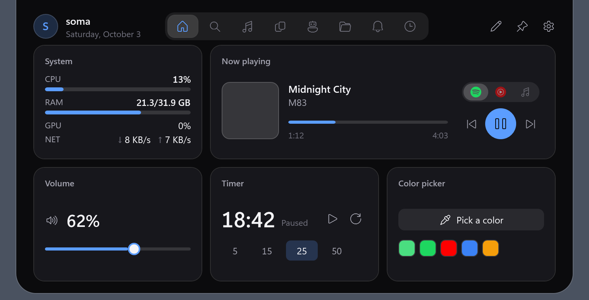
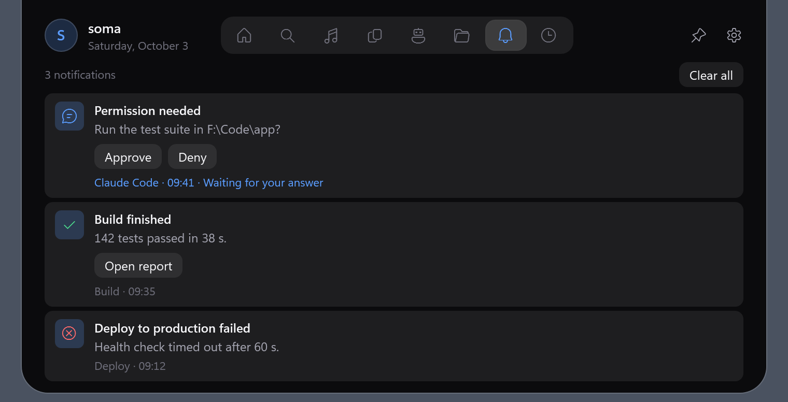
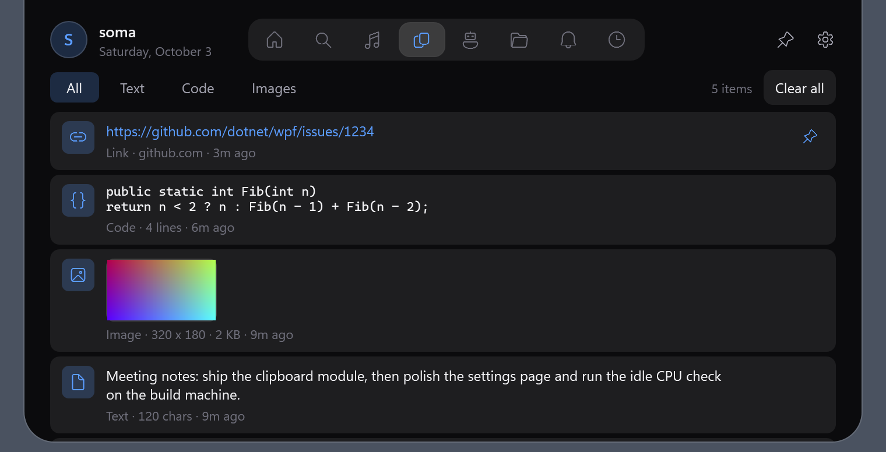
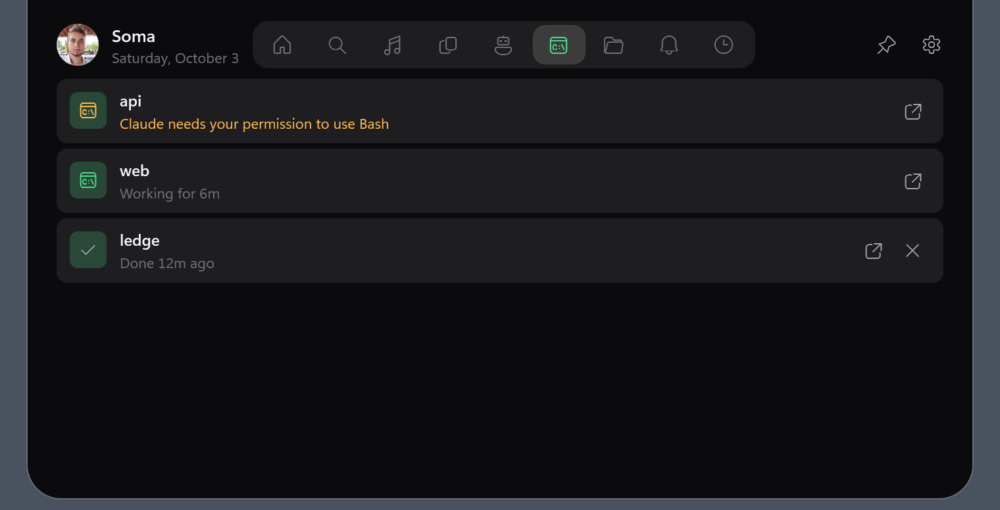

# QNotch

A notch for Windows 11. A slim pill at the top of your screen shows what is playing, system stats and the time. Hover it and it opens into a panel with everything else.




## What it does

- **System stats:** CPU, GPU, RAM, network and battery.
- **Now playing:** track, artwork and controls for anything that plays media.
- **Clipboard history:** text, code, links and images you copied, with pins.
- **Mic and camera:** a glyph in the pill and the game bar while an app uses your microphone or camera.
- **Notifications:** any app or script can post one, with buttons. See [docs/notifications.md](docs/notifications.md).
- **Search** across clipboard, files, notes, notifications and settings.
- **Agents:** every Claude Code and Codex session in the pill and the Agents tab: working, needs you or done, with the tokens each Claude Code session used today and what that would cost at API list prices, plus the dev servers and test runners it started (memory, CPU, ports) and any it left running after its session ended, each with a Stop button. Its Show button brings up the terminal or app it runs in, and in the Claude app or the Codex app opens that session. When one needs you or finishes, the pill widens for a moment with its name and plays a soft sound (never in Game mode or during a call). One click in Settings, Agents connects Claude Code or Codex (Codex then asks you to trust the hooks once).
- **AI apps:** launch them with Alt+1 to Alt+6 and see your Claude Code and Codex usage limits.
- **Note, GitHub contribution graph, file tray, volume, timer, color picker** and your **scheduled tasks**.
- **Move it aside:** drag the pill (or the open panel's header) sideways and fling it out of the way of your tabs, or carry it onto another display. It springs into place, snaps to the center or an edge, and remembers the spot for each app. Double-click it to center it again.
- **Game mode:** when a game or fullscreen video is running, the notch shrinks to a one-line status bar.

Turn off anything you don't use in Settings, Features. A feature that is off is never loaded and costs nothing.

| | |
| --- | --- |
|  |  |




## Install

Windows 10 2004 or newer, x64. Download from [Releases](https://github.com/Somafet/qnotch/releases):

- `QNotch-self-contained.zip` (80 MB): unzip and run. Nothing else to install.
- `QNotch.exe` (27 MB): needs the [.NET 10 Desktop Runtime](https://dotnet.microsoft.com/download/dotnet/10.0).

The exe is not code-signed yet, so Windows may say "Windows protected your PC" on first run. Click **More info**, then **Run anyway**.

Quit from the tray icon.

## Hotkeys

| Keys | Action |
| --- | --- |
| Ctrl+Alt+N | Open or close the panel |
| Ctrl+Alt+F | Search |
| Ctrl+Alt+G | Cycle Game mode: Auto, On, Off |
| Alt+1 to Alt+6 | Launch the AI app in that slot |
| Esc | Close the panel |

Change them in Settings, Hotkeys.

## Sounds

Agent alerts, the timer and (when you turn it on in Settings, Notifications) new notifications play one of your Windows sounds. To use your own, pick an audio file (WAV, MP3, WMA, M4A, AAC or FLAC) for each in Settings, Sounds, or drop one on its row.

## Privacy and data

Settings, notes and logs live in `%APPDATA%\QNotch\`. Tokens (GitHub, notifications) are kept in Windows Credential Manager, never in a file. Clipboard history stays in memory unless you choose to keep it.

Settings, General, Share your setup copies your look, features, card layout, hotkeys and Game mode as one line of text, to paste on another PC. The code leaves out your name and picture, monitor, the Game mode app lists, history, app paths and tokens. Before a code is applied you see what it changes, including any feature it turns back on.

QNotch only goes online for two things, both visible in Settings:

- **GitHub:** your contribution graph, once you add a token.
- **Claude Code usage:** it sends your local Claude Code sign-in to Anthropic's usage endpoint. That endpoint is undocumented, so it may break. Turn it off in Settings, AI.

Codex usage is read from Codex's local files. Agents changes only Claude Code's `settings.json` or Codex's `hooks.json` (with a backup) when you click Connect, and its hook talks to QNotch over a local pipe. Token counts come from the transcripts Claude Code already keeps on your PC.

## Performance

QNotch is built to stay out of the way. Measured on Windows 11, collapsed and idle:

| | Measured | Target |
| --- | --- | --- |
| Idle CPU | 0.08% of one core | 0.1% |
| Memory | about 42 MB | under 80 MB |
| Start to visible pill | about 500 ms | 300 ms |

Startup still misses its target, and copying a 4K screenshot briefly pushes memory to about 185 MB.

## Build

Requires the .NET 10 SDK.

```powershell
dotnet build -c Release
dotnet publish src/QNotch/QNotch.csproj -p:PublishProfile=win-x64                  # into dist\
dotnet publish src/QNotch/QNotch.csproj -p:PublishProfile=win-x64-self-contained   # into dist\self-contained\
```

`QNotch.exe --snapshot <dir>` renders every tab and settings page to PNG, which is how the screenshots above were made.

## Contributing

Bug reports, fixes and new extensions are welcome. Each feature is a self-contained folder in `src/QNotch/Modules/`. Start with [CONTRIBUTING.md](CONTRIBUTING.md) and [ARCHITECTURE.md](ARCHITECTURE.md). [SPEC.md](SPEC.md) has the full specification.

## License

[MIT](LICENSE)
